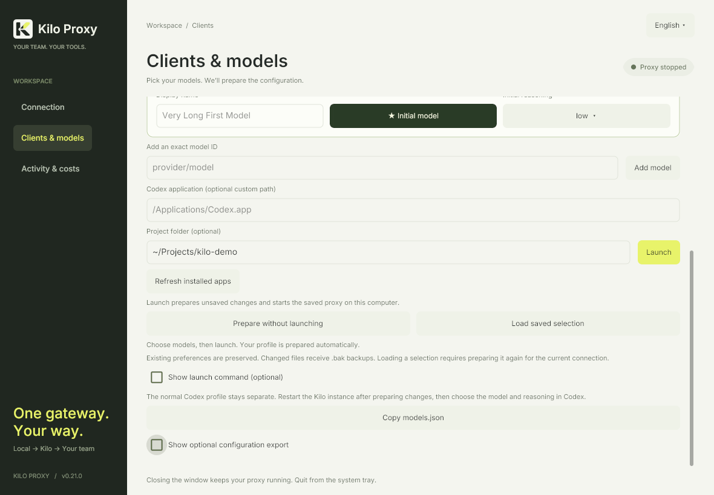
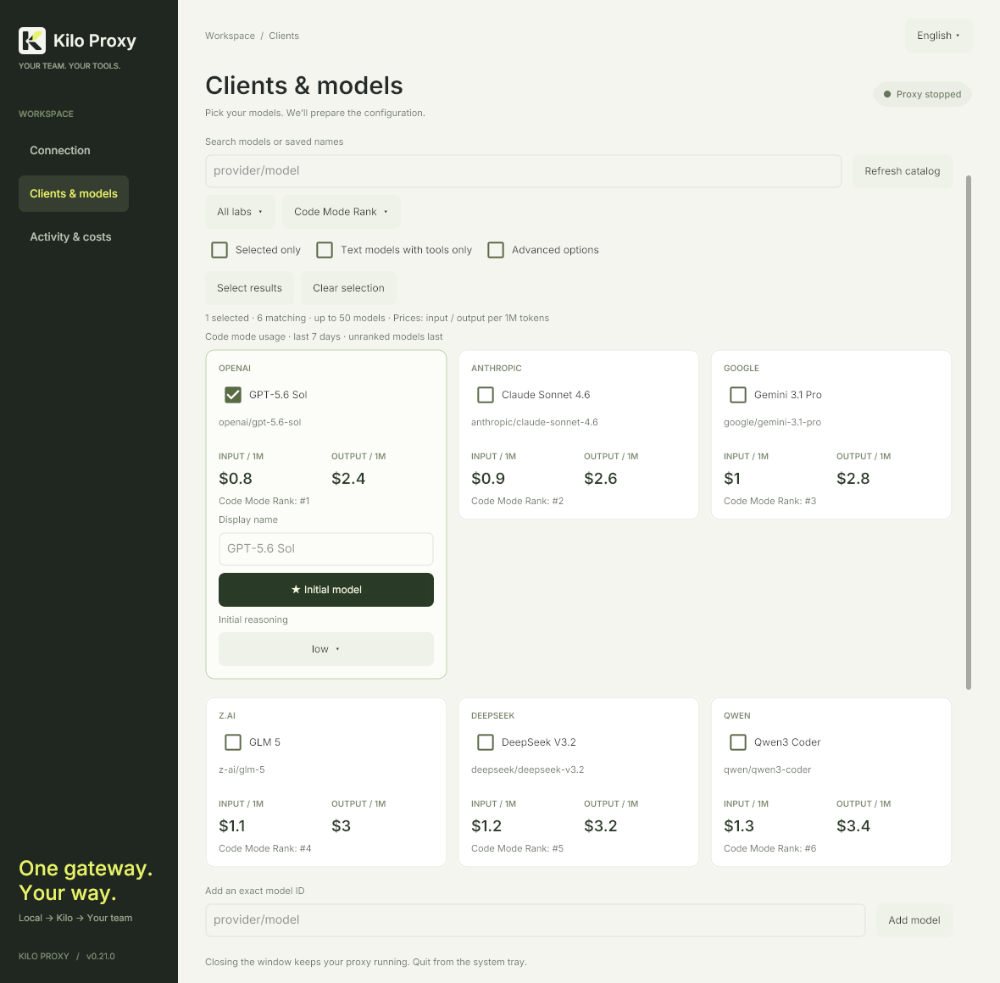
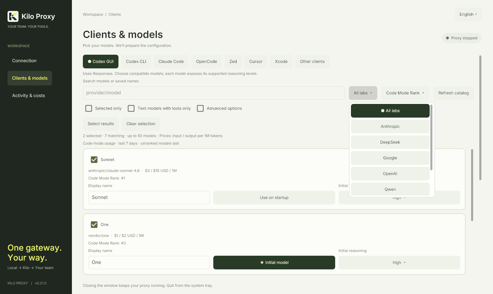

# Client setup

Start Kilo Proxy and open **Clients & models**. Select your editor and models, optionally set **Project folder**, then click **Launch** to prepare changes and open the client. **Prepare without launching** remains available to save without opening it. Optional exports are available when you need to configure another computer; merge those snippets into existing settings. The local key grants access to your organization’s credits while the proxy is running; do not commit generated credentials. The instructions below use the native interface's English labels; the optional browser interface has equivalent helpers with some different button names.

## Launch installed clients

**Launch** always runs on the computer hosting Kilo Proxy. Operating-system and shell selectors in optional exports only change copied commands. The project folder is shared across helper tabs for the current panel session and defaults to your home folder. **Refresh installed apps** checks again after installing a client; the helper does not install applications.

Codex Desktop opens an isolated GUI profile. Codex CLI, Claude Code and OpenCode open interactive terminals. macOS uses Terminal, Windows uses its built-in console, and Linux uses an installed desktop terminal. Zed, Cursor and Xcode open their editors; their one-time provider/key setup remains visible in the helper. Existing editor windows may be focused by the editor itself.

Launch validates saved profile files and the current connection before opening an application, and starts the saved local proxy when needed. Preparation failures stop the launch. Editing models, project folder or the Codex application path while preparation is pending cancels that launch; click again with the new choices. A success message confirms the process was opened, not that a paid inference request succeeded.

Terminal handoff uses a short-lived private ticket consumed before the agent starts. Credentials are not embedded in terminal history or bootstrap arguments, and the parent environment is unchanged. Closing Kilo Proxy does not terminate opened agents, but it does disconnect their proxy. Manual commands and configuration exports remain available.

## Sort the model catalog

Models appear in a responsive card grid in both the native app and browser helper. Wider windows show several models side by side; narrow windows use one column. Each card keeps the model name, exact ID, and input/output prices together. Selecting a model reveals its settings inside the same card, including its display name and supported reasoning controls. Cards expand to fit these settings.

Use **All labs** beside search to filter by a publisher such as OpenAI, Anthropic, Google, or DeepSeek. Choices come from the gateway catalog and your saved manual models, including new publishers automatically. The filter combines with search, coding-capability and selected-only filters. Switching labs never removes a hidden selection or changes its initial-model setting; **Select results** adds only the visible results.

In both the native app and browser helper, the chosen lab and sort order stay active across client tabs during the session. If a catalog refresh or another client has no matching models, the active lab remains available so **All labs** can always reset the view. Publisher names are derived from the gateway provider namespace (or the first segment of an exact manual model ID); a leading `~` is ignored for lab grouping only, while exact request IDs remain unchanged.

The selector beside model search offers the same five criteria as [Kilo's model browser](https://kilo.ai/leaderboard). Your choice stays active across editor tabs for the current app/browser session.

| Sort | Order and meaning |
| --- | --- |
| Code Mode Rank (default) | Lowest rank first, based on Kilo usage in Code mode over the last seven days. This is a usage ranking, not a benchmark score. |
| Coding Index | Highest Artificial Analysis coding score first. |
| Speed | Highest median output tokens per second first. |
| Price | Lowest **input** price per million tokens first. Output prices remain visible beside input prices. |
| Name | A–Z using your custom display name when set, otherwise the catalog name. |

Missing metrics sort last; an explicit zero price or score remains valid. Ties use name and model ID for a stable order. Selected models follow the chosen order too; **Selected only** filters them. Sorting only changes the view: it does not change your initial model, selections, reasoning settings, or prepared editor files.

Rank, coding index, and speed come from [Kilo's public model statistics](https://kilo.ai/api/models/stats), matched by exact gateway model ID. Coverage varies and values are Kilo-published snapshots. The extra request sends no API key or organization header, uses a short timeout, and caches successful results for five minutes. An unavailable statistics service leaves the gateway catalog usable and retains the last successful statistics snapshot when available. Prices and availability always come from the gateway catalog. Custom gateways are not queried against Kilo's public statistics.

## Codex Desktop: a second GUI instance

The **Codex GUI** tab prepares a launcher for the installed desktop application with separate configuration and interface data, allowing your normal Codex to remain open.

1. Select your models. **Launch** creates `~/.codex-kilo-desktop` (`%USERPROFILE%\.codex-kilo-desktop` on Windows) and saves both `config.toml` and `models.json` on this computer.
2. The helper detects installed applications on this computer. If Codex is elsewhere, enter its actual path under **Codex application (optional custom path)**. On macOS this may be `/Applications/ChatGPT.app` or `/Applications/Codex.app`; use the bundle that contains Codex.
3. Choose a project folder if needed and click **Launch**. The new process receives `CODEX_HOME`, `CODEX_ELECTRON_USER_DATA_PATH`, `--user-data-dir`, and `KILO_LOCAL_API_KEY`. The normal Codex profile stays separate.

Interface data lives in `~/Library/Application Support/Codex Kilo` on macOS, `%LOCALAPPDATA%\Codex Kilo` on Windows, or `${XDG_CONFIG_HOME:-~/.config}/codex-kilo-desktop` on Linux. Relaunching the same isolated profile may focus its existing window.

Keep the normal `~/.codex/config.toml` unchanged. Do not copy its `auth.json`, cookies, or history. The generated provider uses the local proxy key and `cli_auth_credentials_store = "file"`. Profiles isolate settings and history, not workspaces: use separate checkouts or worktrees for concurrent edits to the same repository. If you previously edited your main config, restore its original provider/model manually.

The Electron isolation variable is version-dependent rather than a stable public API. [Compatibility notes](codex-desktop-compatibility.md) describe the inspected macOS version and what was tested. The original vendor app is installed separately and is not redistributed here. Windows and Linux require verification with the installed app version.

### Multiple models, reasoning, and short names

1. Check models in the catalog, or select search results in bulk, up to 50. **Selected only** filters the same list. Manual IDs are under **Add an exact model ID**.
2. Adjust **Initial reasoning** in the selected row and choose **Use on startup** for the initial model. Enable **Advanced options**, then **Customize supported reasoning levels** to change available efforts; **Restore suggested levels** restores known defaults.
3. Edit **Display name** for a short display name such as Sol, GLM, or Fable. Clearing it restores the catalog label. Names are limited to 80 characters and searchable.
4. Click **Prepare without launching**. The helper creates missing files and updates Kilo settings in an existing `config.toml`: initial model, reasoning, catalog path, local port, Responses protocol and environment-variable authentication. Other settings and comments are preserved; conflicting Kilo authentication settings are removed. A selected named profile is synchronized too.
5. Click **Launch** to open Codex. You can also skip the separate Prepare step: Launch saves pending changes first. Close the existing Kilo instance before relaunching after changing its port or credential. Manual commands remain under optional exports.

**Load saved selection** restores models, labels, and reasoning. Unsaved changes last only for the panel session. Saving updates both profile files without storing the local API key in TOML. Each changed existing file receives an exact `.bak` copy; saving unchanged files leaves backups intact. Invalid TOML and unsafe file destinations stop the save without replacing either profile file. The config references `model_catalog_json = "models.json"`; the exporter puts the initial model first because the inspected app-server’s `model/list` default follows catalog order.

Model IDs remain unchanged. Renaming changes only `display_name`; reasoning is sent as `reasoning.effort`. Explicit efforts from Kilo’s `opencode.variants` metadata take priority over exact-ID fallback presets. Manual customizations take priority over both. Variant names and token budgets are not interpreted as effort levels. Unknown models receive no invented levels and can be configured manually.

Current exact-ID presets include Sol discounted (none/low/medium/high/xhigh/max, initially low), GLM 5.3 and 5.3 Flash (low/high/max, initially max), and Fable 5.1 (low/medium/high/xhigh/max, initially high). These are metadata/preset choices, not guarantees that every gateway route accepts every effort.

All models in this profile must support **Responses**. Catalog listing does not translate protocols or verify credits. Exported capabilities are conservative and coding instructions are original generic instructions, not vendor system prompts.

**Show optional configuration export** and **Copy models.json** remain available for another computer. Automatic preparation always targets the computer running Kilo Proxy, regardless of the launcher platform selected in the helper.

### “Missing environment variable”

Copy `env_key = "KILO_LOCAL_API_KEY"` literally. It names an environment variable; never replace it with the actual token. Use **Launch** to supply the local key automatically when opening Codex. Close a previously running Kilo instance before relaunching with updated environment values.

For manual command exports, the on-screen preview masks the key and cannot be executed as displayed. **Copy launch command** copies the complete command with the real local key. The native preview intentionally has no separate copy button.

### Fable / Anthropic tool schemas

For `/v1/responses` requests to `anthropic/*` and `~anthropic/*`, the proxy adapts function schemas with root `oneOf`, `anyOf`, or `allOf`. The original schema is preserved under required `kilo_tool_input`; constraints are not removed or flattened. Namespaced tools are supported.

Historical call arguments are wrapped and new arguments are unwrapped before reaching Codex. For affected tools only, SSE argument fragments are buffered until `response.function_call_arguments.done` and emitted as one validated delta. Other events and keepalives continue streaming. Invalid or incomplete wrappers stop the response rather than send malformed calls.

Local JSON Pointer references are relocated. Schemas with IDs, anchors, external references, or dynamic references are rejected because they require additional resolution. Requests, adapted JSON responses, and individual SSE events have a 32 MiB limit. This is schema adaptation, not a Responses-to-Messages translator; protocol support still depends on Kilo.

## Codex CLI

The **Codex CLI** tab offers the same helper as Codex Desktop, with an independent model selection and profile:

1. Check models in the catalog, or add exact IDs manually. Set short display names, the initial model and supported reasoning levels in each row.
2. Click **Prepare without launching**. Kilo Proxy creates `~/.codex-kilo-cli` (`%USERPROFILE%\.codex-kilo-cli` on Windows) and saves `config.toml` plus `models.json`. Existing Kilo settings are updated; unrelated settings and comments are retained, with exact `.bak` backups of changed files.
3. Set **Project folder** and click **Launch** to open an interactive terminal there. Install Codex CLI first; common installation paths and the bundled macOS CLI are detected. Launch also prepares unsaved changes and scopes the local key and `CODEX_HOME` to this session.
4. Use `/model` inside Codex CLI to select a model and its reasoning level. Restart the CLI session after changing the catalog in the helper. **Load saved selection** restores this CLI profile's models, names and reasoning choices.

GUI and CLI selections, saved catalogs and readiness indicators are independent. Codex Desktop continues to use `~/.codex-kilo-desktop`; ordinary Codex continues to use its usual profile. Both Kilo integrations use HTTP Responses and the same model capability catalog format. Optional TOML and JSON exports remain available for another computer. Preparation always writes on the computer running Kilo Proxy.

The generated CLI profile was checked against the Codex executable bundled with the installed desktop app: both selected models, short labels, the initial model and exact reasoning choices appeared in `model/list`, without inference. The separate npm CLI installation on the development machine could not be validated because its executable was missing, including after reinstalling the same version.

Reference: [OpenAI configuration reference: model_catalog_json](https://learn.chatgpt.com/docs/config-file/config-reference).

## OpenCode

The helper selects multiple models, short names, limits, and an initial model, then creates or updates `~/.opencode-kilo/opencode.json` with the local proxy credential. Click **Launch** to open it in a terminal, and use `/models` to switch models; `/connect` is not needed for this prepared profile. JSONC settings are preserved with exact backups. Global/project OpenCode configuration still merges. See [OpenCode and Zed setup](opencode-and-zed.md).

## Claude Code: automatic isolated setup

1. Open **Claude Code** in the helper. It detects your installed version and shows whether the Kilo configuration is supported. Use **Detect installed version** after updating Claude.
2. Check models directly in the catalog. Edit a short name, choose **Use on startup**, and set supported reasoning preferences in each row. Manual IDs, search, prices, bulk selection and **Selected only** work like the Codex Desktop picker.
3. Click **Prepare without launching**. This creates `~/.claude-kilo` (`%USERPROFILE%\.claude-kilo` on Windows), saves `settings.json` and `kilo-models.json`, and shows **Editor profile prepared**. Changed existing files receive exact `.bak` backups. Unrelated settings such as permissions and hooks are retained.
4. Set **Project folder** and click **Launch**. It prepares pending changes and opens a terminal with `CLAUDE_CONFIG_DIR` and `--settings`, clearing conflicting inherited authentication/provider variables for that child. The normal Claude profile remains available in another terminal.
5. Use `/model` to switch models. Restart a Kilo session after preparing changes. **Load saved selection** restores selected models, names, initial model, aliases and reasoning preferences.

The profile contains only the local proxy credential, not your Kilo account key. It configures `ANTHROPIC_BASE_URL` without a trailing `/v1`, uses bearer authentication, and maps internal Sonnet/Opus/Haiku aliases to selected models. Modern versions also pin the Fable default. Advanced alias assignments are optional. Existing Kilo routing/authentication/model mappings are refreshed; policy settings such as `availableModels` remain in force.

### Compared with Codex Desktop

| Feature | Claude Code with Kilo Proxy |
| --- | --- |
| Automatic profile creation, updates and backups | Supported on macOS, Linux and Windows |
| Multiple models and short native picker labels | `modelPicker` from Claude Code 2.1.242; earlier versions use three aliases and `/model ID` commands |
| Per-model persistent effort | `modelSettings` from 2.1.251, for recognized Claude models; earlier versions use a global initial effort |
| Arbitrary Codex reasoning levels | Not portable. Claude accepts its own model-dependent levels; `max` is session-only, and unknown/non-Claude models receive no invented effort options |
| Catalog prices and request inspection | Available in Kilo Proxy; Claude's own price calculations can differ |
| Spend by conversation | Uses `x-claude-code-session-id` when present; missing billing/session data remains unknown or unassigned |
| Independent running clients | Separate terminal sessions with the isolated Claude profile |
| Second desktop GUI instance | This launcher opens Claude Code in a terminal. It does not configure Claude Desktop |

Under **Claude compatibility**, **installed** matches the detected version. If preparing for Claude Code 2.1.251 or later, select **modern** and update it before launching. Upgrade with `claude update`, then detect the version and prepare again. The helper reports configuration compatibility, not a successful paid gateway request.

Recognized Claude families use native model IDs in the picker plus `modelOverrides` to send the original Kilo ID to the gateway. This avoids gateway spellings such as `anthropic/claude-fable-5.1` losing native reasoning recognition. Choose one gateway spelling per native family/version. Per-model effort preferences are keyed by Claude's canonical model name. Fable 5, Opus 4.7 and Opus 4.8 can retain their first-use default until an explicit `/effort` choice; the helper documents that native behavior.

Models must support Anthropic Messages, tools and the capabilities Claude sends. Anthropic does not officially support non-Claude models through gateways; configuring an ID does not certify compatibility. The proxy forwards `/v1/messages?beta=true`, version/beta headers and streaming responses. Optional token-counting endpoints are not implemented; Claude can fall back. Organization policy and access restrictions still apply.

See [Claude Code compatibility verification](claude-code-compatibility.md).

## Zed

Select several models and short names, then click **Prepare without launching** to update its user settings and Agent default model. The helper preserves comments, other providers, and unrelated settings, with backups. **Launch** prepares pending changes and opens Zed. Copy the local key once into Zed's `kilo-local` provider settings so Zed stores it in its keychain. See [OpenCode and Zed setup](opencode-and-zed.md) for paths, limits, and verification.

## Xcode

The **Xcode** tab has three independent variants: **Chat**, **Codex** and **Claude**. Chat saves a dedicated model list and copies the provider connection details; its URL ends in `/xcode`, without `/v1`. The agent variants prepare Apple's dedicated profile folders on macOS with backups. Claude options use Xcode's advertised agent version, not the terminal installation. **Launch** prepares changes and opens Xcode without forcing a restart or closing projects. Complete the chosen variant's one-time setup inside Xcode. See [Xcode setup and compatibility](xcode.md).

## Cursor

The helper manages a dedicated ngrok HTTPS tunnel, since Cursor's servers cannot reach localhost. Install ngrok 3 and configure its account once, start the local proxy, select up to 50 model IDs, and click **Connect HTTPS tunnel**. Copy the public URL and dedicated Cursor key into **Settings → Models → OpenAI API Key / Override OpenAI Base URL**. **Launch** opens Cursor once this tunnel is running; it never starts a public tunnel automatically. Add the exact custom IDs and select one in chat.

**Test public connection** checks authentication and model-list reachability without inference charges. Disconnecting revokes the key. Only selected models and Chat Completions are exposed; the control panel remains local. Prompts pass through Cursor, ngrok, and Kilo. Cursor's BYOK limitations still apply, including Tab/Composer and model-dependent reasoning or Agent support.

See the [complete Cursor guide](cursor.md) for setup, account requirements, troubleshooting, and tested coverage.

## Sources

- [Kilo authentication](https://kilo.ai/docs/gateway/authentication), [API reference](https://kilo.ai/docs/gateway/api-reference), and [model metadata](https://kilo.ai/docs/gateway/models-and-providers).
- [Codex configuration](https://developers.openai.com/codex/config-reference) and [advanced configuration](https://developers.openai.com/codex/config-advanced).
- [OpenCode models](https://opencode.ai/docs/models/) and [custom providers](https://opencode.ai/docs/providers/#custom-provider).
- [Claude Code gateways](https://code.claude.com/docs/en/llm-gateway-connect) and [model configuration](https://code.claude.com/docs/en/model-config).
- [Zed API providers](https://zed.dev/docs/ai/use-api-access#openai-compatible).
- [Cursor API keys](https://prod.cursor.com/help/models-and-usage/api-keys), [localhost limitation](https://forum.cursor.com/t/how-can-i-use-a-local-llm-on-my-desktop-ai-computer/152419), and [custom IDs](https://forum.cursor.com/t/add-custom-model-fail-no-models-available/163488).

Compatibility was investigated on September 7, 2026. Vendor behavior can change; the version-specific verification record is in [Codex compatibility notes](codex-desktop-compatibility.md).
