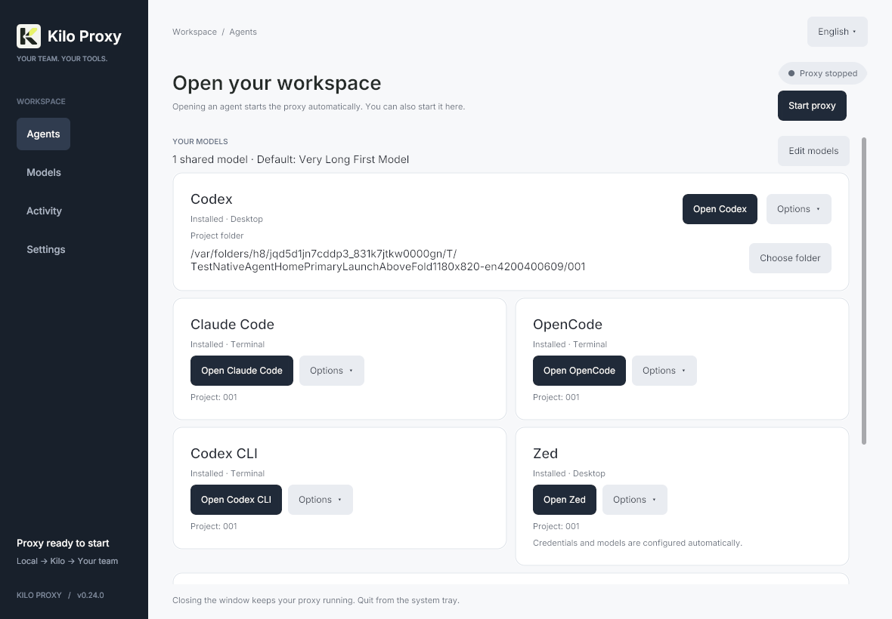
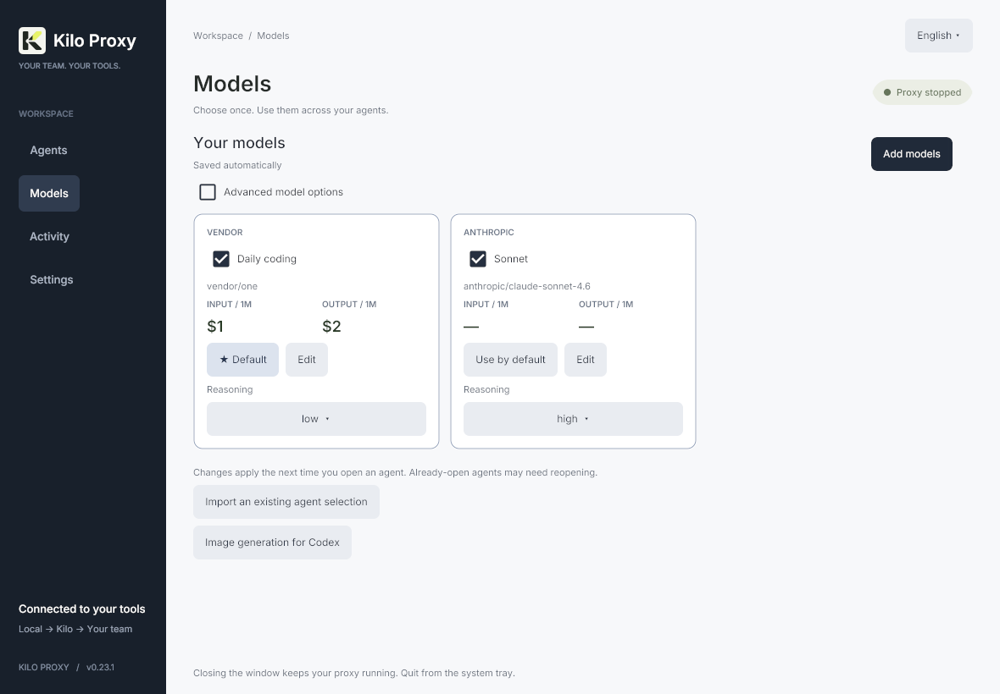

# Client setup

Use **Models** to build one automatically saved library, then **Agents** to open an installed client. Each card shows installation status and an **Open** action; **Options → Integration settings** contains manual preparation, provider setup and exports. **Activity** shows observed requests and costs, and **Settings** manages your account, connection and appearance. The first launch opens Settings when a connection has not been configured; a configured app opens Agents.

The local key grants access to your organization’s credits while the proxy is running; do not commit generated credentials. The instructions below use the native interface's English labels. The optional `--browser` helper is a separate older interface with independent per-client selections and explicit preparation. It does not edit the native shared library.

## Launch installed clients

Choose models once in **Models → Add models** and set their names, default, order and supported reasoning preferences. The library survives restarts; see [shared models and storage](shared-models.md). Return to **Agents**, choose a project folder and click **Open Codex** or another agent's Open button. The action saves pending library edits, prepares that agent's generated profile when necessary, starts the saved proxy and opens the installed client on this computer. It does not install applications.

Codex Desktop opens the GUI with an isolated profile. **Codex CLI**, **Claude Code** and **OpenCode** open interactive terminals: Terminal on macOS, a console on Windows and an installed desktop terminal on Linux. **Zed** and **Cursor** open their editors. **Set up Xcode** and **Other clients** lead to provider-specific guidance. Existing editor windows may be focused by the editor itself.

**Open Design** runs **Codex CLI**, **Claude Code** or **OpenCode** in its **Local CLI** mode. Choose an engine under **Engine settings** on its card, then click **Launch Open Design**. Kilo Proxy prepares private engine profiles from the shared models, starts the proxy and opens a separate Open Design workspace on macOS or Windows. Keep **CLI default** for the shared default and open your project inside Open Design. Its model picker can differ from the CLI catalog. See [Open Design setup, restart behavior and Linux guidance](open-design.md).

To use your existing terminal on macOS or Linux, install `kilo-codex` and `kilo-claude` from **Settings → Terminal commands → Install terminal commands**. They run in that terminal's current project folder, forward arguments, and prepare the latest saved shared models on each invocation. Keep Kilo Proxy open, including in the tray; a stopped saved proxy connection starts automatically. See [terminal commands](terminal-commands.md) for installation, resume examples and PATH setup.

**Choose folder** opens a platform folder chooser. Each agent remembers its own project, with up to six recent folders in **Options**; a new agent defaults to your home folder. Folder paths and a custom Codex path are saved separately in `agent-preferences.json`. Linux uses an installed zenity or kdialog; if neither is available, enter the path under Options. **Locate Codex** chooses a nonstandard Desktop installation. Missing applications show installation guidance; use **Options → Refresh detection** after installing them.

Launch validates saved profile files and the current connection. Preparation failures stop it. Changes to models, connection, project or the Codex application path during preparation cancel that launch; click again with the new choices. Installation status and a successful open confirm discovery/process handoff, not a running-agent health check or successful paid inference. Library changes apply on the next preparation/open; already running agents may need reopening.

Terminal handoff uses a short-lived private ticket consumed before the agent starts. Credentials are not embedded in terminal history or bootstrap arguments, and the parent environment is unchanged. Quitting Kilo Proxy disconnects opened agents from their proxy without terminating them. Optional operating-system and shell selectors affect copied commands only; automatic preparation and Open always run on the computer hosting Kilo Proxy.

## Sort the model catalog

In the native app, open **Models → Add models** to browse a responsive card grid. The optional browser helper retains its own model grids. Wider windows show several models side by side; narrow windows use one column. Each card keeps the model name, exact ID, and input/output prices together. Select models, then choose **Done** to return to the saved library. Its cards show the default and supported reasoning controls; **Edit** reveals the display name and additional settings. Cards expand to fit those settings.

Use **All labs** beside search to filter by a publisher such as OpenAI, Anthropic, Google, or DeepSeek. Choices come from the gateway catalog and your saved manual models, including new publishers automatically. The filter combines with search, coding-capability and selected-only filters. Switching labs never removes a hidden selection or changes its initial-model setting; **Select results** adds only the visible results.

The native catalog keeps its chosen lab and sort order during the session. If a refresh has no matching models, **All labs** can always reset the view. In the browser helper, these discovery controls remain shared across its client tabs. Publisher names are derived from the gateway provider namespace (or the first segment of an exact manual model ID); a leading `~` is ignored for lab grouping only, while exact request IDs remain unchanged.

The selector beside model search offers the same five criteria as [Kilo's model browser](https://kilo.ai/leaderboard). Your choice stays active for the current discovery session.

| Sort | Order and meaning |
| --- | --- |
| Code Mode Rank (default) | Lowest rank first, based on Kilo usage in Code mode over the last seven days. This is a usage ranking, not a benchmark score. |
| Coding Index | Highest Artificial Analysis coding score first. |
| Speed | Highest median output tokens per second first. |
| Price | Lowest **input** price per million tokens first. Output prices remain visible beside input prices. |
| Name | A–Z using your custom display name when set, otherwise the catalog name. |

Missing metrics sort last; an explicit zero price or score remains valid. Ties use name and model ID for a stable order. In the discovery view, **Selected only** filters selected models. Catalog sorting does not change the saved library order, default, selections, reasoning settings or prepared files. Use the library move controls to change its saved order.

Rank, coding index, and speed come from [Kilo's public model statistics](https://kilo.ai/api/models/stats), matched by exact gateway model ID. Coverage varies and values are Kilo-published snapshots. The extra request sends no API key or organization header, uses a short timeout, and caches successful results for five minutes. An unavailable statistics service leaves the gateway catalog usable and retains the last successful statistics snapshot when available. Prices and availability always come from the gateway catalog. Custom gateways are not queried against Kilo's public statistics.

## Codex Desktop: a second GUI instance

The **Codex** card opens the installed Desktop GUI with separate configuration and interface data, allowing your normal Codex to remain open. **Codex CLI** is a separate terminal action.

1. Edit the shared library in **Models**, including names, a default model and supported reasoning preferences.
2. On **Agents**, use **Choose folder** and **Open Codex**. Kilo Proxy prepares `~/.codex-kilo-desktop` (`%USERPROFILE%\.codex-kilo-desktop` on Windows), including `config.toml` and its generated `models.json`.
3. If Desktop is not detected, use **Locate Codex**, or enter the application path in **Options**. On macOS the installed bundle may be `/Applications/Codex.app` or `/Applications/ChatGPT.app`.

The child receives `CODEX_HOME`, `CODEX_ELECTRON_USER_DATA_PATH`, `--user-data-dir` and `KILO_LOCAL_API_KEY`. The normal Codex profile stays separate.

Interface data lives in `~/Library/Application Support/Codex Kilo` on macOS, `%LOCALAPPDATA%\Codex Kilo` on Windows, or `${XDG_CONFIG_HOME:-~/.config}/codex-kilo-desktop` on Linux. Relaunching the same isolated profile may focus its existing window.

Keep the normal `~/.codex/config.toml` unchanged. Do not copy its `auth.json`, cookies, or history. The generated provider uses the local proxy key and `cli_auth_credentials_store = "file"`. Profiles isolate settings and history, not workspaces: use separate checkouts or worktrees for concurrent edits to the same repository. If you previously edited your main config, restore its original provider/model manually.

The Electron isolation variable is version-dependent rather than a stable public API. [Compatibility notes](codex-desktop-compatibility.md) describe the inspected macOS version and what was tested. The original vendor app is installed separately and is not redistributed here. Windows and Linux require verification with the installed app version.

### Multiple models, reasoning, and short names

The native **Models** page is the source for both Codex integrations. Add up to 50 exact IDs, edit display names, choose the default and set supported reasoning. Open a model card's **Edit** controls for its name and additional preferences; advanced options expose custom supported reasoning levels. Names are limited to 80 characters. These preferences save automatically in the common library, independently of generated profiles.

**Open Codex** prepares pending profile changes before launching. To save a profile without opening it, use **Options → Integration settings → Prepare without launching**. Preparation updates the initial model, reasoning, catalog path, local port, Responses protocol and environment-variable authentication. Unrelated settings and comments are preserved, conflicting Kilo authentication settings are removed and a selected named profile is synchronized too.

A changed existing profile file receives an exact `.bak` copy; unchanged writes preserve backups. Invalid TOML and unsafe destinations stop preparation. Codex TOML names the local-key environment variable without storing the key itself. Its `model_catalog_json = "models.json"` refers to the generated catalog in that agent profile, not the application's shared library. The exporter puts the default first because the inspected app-server's `model/list` default follows catalog order.

Use **Models → Import an existing agent selection** to review and import an old Desktop or CLI profile into the common library. Reopen the Kilo Codex instance after preparing a changed catalog or connection; there is no automatic update of an already running instance.

Model IDs remain unchanged. Renaming changes only `display_name`; reasoning is sent as `reasoning.effort`. Explicit efforts from Kilo’s `opencode.variants` metadata take priority over exact-ID fallback presets. Manual customizations take priority over both. Variant names and token budgets are not interpreted as effort levels. Unknown models receive no invented levels and can be configured manually.

Current exact-ID presets include Sol discounted (none/low/medium/high/xhigh/max, initially low), GLM 5.3 and 5.3 Flash (low/high/max, initially max), and Fable 5.1 (low/medium/high/xhigh/max, initially high). These are metadata/preset choices, not guarantees that every gateway route accepts every effort.

All models in this profile must support **Responses**. Catalog listing does not translate protocols or verify credits. Exported capabilities are conservative and coding instructions are original generic instructions, not vendor system prompts.

**Show optional configuration export** and **Copy models.json** remain available for another computer. Automatic preparation always targets the computer running Kilo Proxy, regardless of the launcher platform selected in the helper.

### “Missing environment variable”

Copy `env_key = "KILO_LOCAL_API_KEY"` literally. It names an environment variable; never replace it with the actual token. Use **Open Codex** to supply the local key automatically when opening Desktop, or **Open Codex CLI** for the terminal. Close a previously running Kilo instance before relaunching with updated environment values.

For manual command exports, the on-screen preview masks the key and cannot be executed as displayed. **Copy launch command** copies the complete command with the real local key. The native preview intentionally has no separate copy button.

### Fable / Anthropic tool schemas

For `/v1/responses` requests to `anthropic/*` and `~anthropic/*`, the proxy adapts function schemas with root `oneOf`, `anyOf`, or `allOf`. The original schema is preserved under required `kilo_tool_input`; constraints are not removed or flattened. Namespaced tools are supported.

Historical call arguments are wrapped and new arguments are unwrapped before reaching Codex. For affected tools only, SSE argument fragments are buffered until `response.function_call_arguments.done` and emitted as one validated delta. Other events and keepalives continue streaming. Invalid or incomplete wrappers stop the response rather than send malformed calls.

Local JSON Pointer references are relocated. Schemas with IDs, anchors, external references, or dynamic references are rejected because they require additional resolution. Requests, adapted JSON responses, and individual SSE events have a 32 MiB limit. This is schema adaptation, not a Responses-to-Messages translator; protocol support still depends on Kilo.

## Codex CLI

Choose **Open Codex CLI** on Agents to open an interactive terminal in its remembered project folder. It uses the same shared model library as Desktop and prepares its own `~/.codex-kilo-cli` (`%USERPROFILE%\.codex-kilo-cli` on Windows), with `config.toml` and a generated `models.json`. Existing unrelated settings and comments are preserved with exact `.bak` backups.

Common installation paths and the CLI bundled in the macOS Desktop app are detected. The local key and `CODEX_HOME` are scoped to the new session. Use `/model` in Codex CLI to select a model and its supported reasoning; reopen it after library changes. Desktop and CLI share model preferences but keep separate generated files and readiness state, and ordinary Codex retains its usual profile. Both integrations use Responses.

On macOS and Linux, the installed `kilo-codex` command uses the same CLI profile in your current terminal. Use `kilo-codex resume` to return to a session saved in that isolated profile. [Command setup and examples](terminal-commands.md).

Manual preparation and command/configuration exports remain under **Options → Integration settings**. The generated CLI catalog has been checked with a disposable installed app-server profile through `model/list`, without inference; that does not establish compatibility with every installed CLI version.

Reference: [OpenAI configuration reference: model_catalog_json](https://learn.chatgpt.com/docs/config-file/config-reference).

## OpenCode

The OpenCode card derives IDs, names, limits and the default from the shared library, then creates or updates `~/.opencode-kilo/opencode.json` with the local proxy credential. Click **Open OpenCode** to open it in a terminal, and use `/models` to switch models; `/connect` is not needed for this prepared profile. JSONC settings are preserved with exact backups. Global/project OpenCode configuration still merges. See [OpenCode and Zed setup](opencode-and-zed.md).

## Claude Code: automatic isolated setup

On macOS and Linux, the installed `kilo-claude` command prepares the same isolated Claude profile and runs in your current terminal. Use `kilo-claude --resume` to select a session from that profile. [Command setup and examples](terminal-commands.md).

1. Choose shared models and preferences in **Models**. On **Agents**, the Claude Code card checks the installed version. Its **Options → Refresh detection** action checks again after an update.
2. Use the card's **Options** to choose its project folder, then **Open Claude Code**. The helper prepares `~/.claude-kilo` (`%USERPROFILE%\.claude-kilo` on Windows), including `settings.json` and `kilo-models.json`, before opening an interactive terminal. Changed files receive exact `.bak` backups; unrelated permissions and hooks are preserved.
3. Use `/model` to switch models. Reopen the Kilo session after changing the common library. Manual preparation and compatibility settings remain under **Options → Integration settings**.

The child uses `CLAUDE_CONFIG_DIR` and `--settings`, clearing conflicting inherited authentication/provider variables for that child. The normal Claude profile remains available in another terminal. Shared reasoning preferences are filtered to levels supported by the selected model and installed version.

The profile contains only the local proxy credential, not your Kilo account key. It configures `ANTHROPIC_BASE_URL` without a trailing `/v1`, uses bearer authentication, and maps internal Sonnet/Opus/Haiku aliases to selected models. Modern versions also pin the Fable default. Existing Kilo routing/authentication/model mappings are refreshed; policy settings such as `availableModels` remain in force.

### Compared with Codex Desktop

| Feature | Claude Code with Kilo Proxy |
| --- | --- |
| Automatic profile creation, updates and backups | Supported on macOS, Linux and Windows |
| Multiple models and short native picker labels | `modelPicker` from Claude Code 2.1.242; earlier versions use three aliases and `/model ID` commands |
| Per-model persistent effort | `modelSettings` from 2.1.251, for recognized Claude models; earlier versions use a global initial effort |
| Arbitrary Codex reasoning levels | Not portable. Claude accepts its own model-dependent levels; `max` is session-only, and unknown/non-Claude models receive no invented effort options |
| Catalog prices and request inspection | Available in Kilo Proxy; Claude's own price calculations can differ |
| Spend by conversation | Uses `x-claude-code-session-id` when present; missing billing/session data remains unknown or unassigned |
| Independent running clients | Separate terminal sessions with the isolated Claude profile |
| Second desktop GUI instance | This launcher opens Claude Code in a terminal. It does not configure Claude Desktop |

Under **Claude compatibility**, **installed** matches the detected version. If preparing for Claude Code 2.1.251 or later, select **modern** and update it before launching. Upgrade with `claude update`, then detect the version and prepare again. The helper reports configuration compatibility, not a successful paid gateway request.

Recognized Claude families use native model IDs in the picker plus `modelOverrides` to send the original Kilo ID to the gateway. This avoids gateway spellings such as `anthropic/claude-fable-5.1` losing native reasoning recognition. Choose one gateway spelling per native family/version. Per-model effort preferences are keyed by Claude's canonical model name. Fable 5, Opus 4.7 and Opus 4.8 can retain their first-use default until an explicit `/effort` choice; the helper documents that native behavior.

Models must support Anthropic Messages, tools and the capabilities Claude sends. Anthropic does not officially support non-Claude models through gateways; configuring an ID does not certify compatibility. The proxy forwards `/v1/messages?beta=true`, version/beta headers and streaming responses. Optional token-counting endpoints are not implemented; Claude can fall back. Organization policy and access restrictions still apply.

See [Claude Code compatibility verification](claude-code-compatibility.md).

## Zed

**Open Zed** prepares the common library's IDs, names, limits and default in its user settings, then opens the editor. Reasoning remains automatic. Other providers, comments and unrelated settings are preserved with backups. Preparation also saves the local proxy key in the system credential store. Existing Zed projects stay open; the provider reloads its credentials when the managed connection changes. **Copy key for Zed (recovery)** remains available under **Options → Integration settings** for manual recovery. See [OpenCode and Zed setup](opencode-and-zed.md).

## Xcode

**Agents → Set up Xcode** has three integration variants using the shared library: **Chat**, **Codex** and **Claude**. Chat saves a dedicated model list and copies the provider connection details; its URL ends in `/xcode`, without `/v1`. The agent variants prepare Apple's dedicated profile folders on macOS with backups. Claude options use Xcode's advertised agent version, not the terminal installation. **Launch** prepares changes and opens Xcode without forcing a restart or closing projects. Complete the chosen variant's one-time setup inside Xcode. See [Xcode setup and compatibility](xcode.md).

## Cursor

The helper manages a dedicated ngrok HTTPS tunnel, since Cursor's servers cannot reach localhost. Install ngrok 3 and configure its account once, start the local proxy, choose shared models, and use **Agents → Cursor → Set up tunnel → Connect HTTPS tunnel**. Copy the public URL and dedicated Cursor key into **Settings → Models → OpenAI API Key / Override OpenAI Base URL**. **Open Cursor** opens Cursor once this tunnel is running; it never starts a public tunnel automatically. Add the exact custom IDs and select one in chat.

**Test public connection** checks authentication and model-list reachability without inference charges. Disconnecting revokes the key. Only selected models and Chat Completions are exposed; the control panel remains local. Prompts pass through Cursor, ngrok, and Kilo. Cursor's BYOK limitations still apply, including Tab/Composer and model-dependent reasoning or Agent support.

See the [complete Cursor guide](cursor.md) for setup, account requirements, troubleshooting, and tested coverage.

## Sources

- [Kilo authentication](https://kilo.ai/docs/gateway/authentication), [API reference](https://kilo.ai/docs/gateway/api-reference), and [model metadata](https://kilo.ai/docs/gateway/models-and-providers).
- [Codex configuration](https://developers.openai.com/codex/config-reference) and [advanced configuration](https://developers.openai.com/codex/config-advanced).
- [OpenCode models](https://opencode.ai/docs/models/) and [custom providers](https://opencode.ai/docs/providers/#custom-provider).
- [Claude Code gateways](https://code.claude.com/docs/en/llm-gateway-connect) and [model configuration](https://code.claude.com/docs/en/model-config).
- [Zed API providers](https://zed.dev/docs/ai/use-api-access#openai-compatible).
- [Cursor API keys](https://prod.cursor.com/help/models-and-usage/api-keys), [localhost limitation](https://forum.cursor.com/t/how-can-i-use-a-local-llm-on-my-desktop-ai-computer/152419), and [custom IDs](https://forum.cursor.com/t/add-custom-model-fail-no-models-available/163488).

Compatibility was investigated on September 7, 2026. Vendor behavior can change; the version-specific verification record is in [Codex compatibility notes](codex-desktop-compatibility.md).
