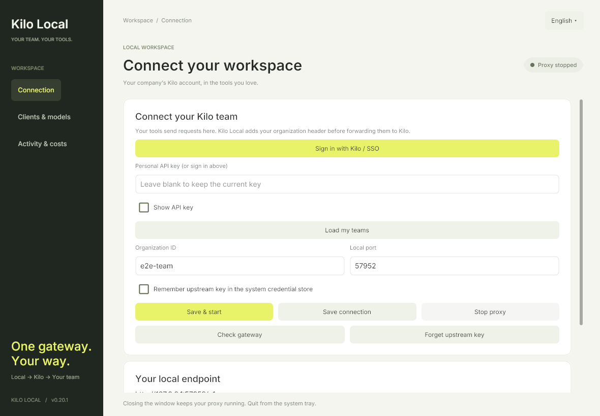
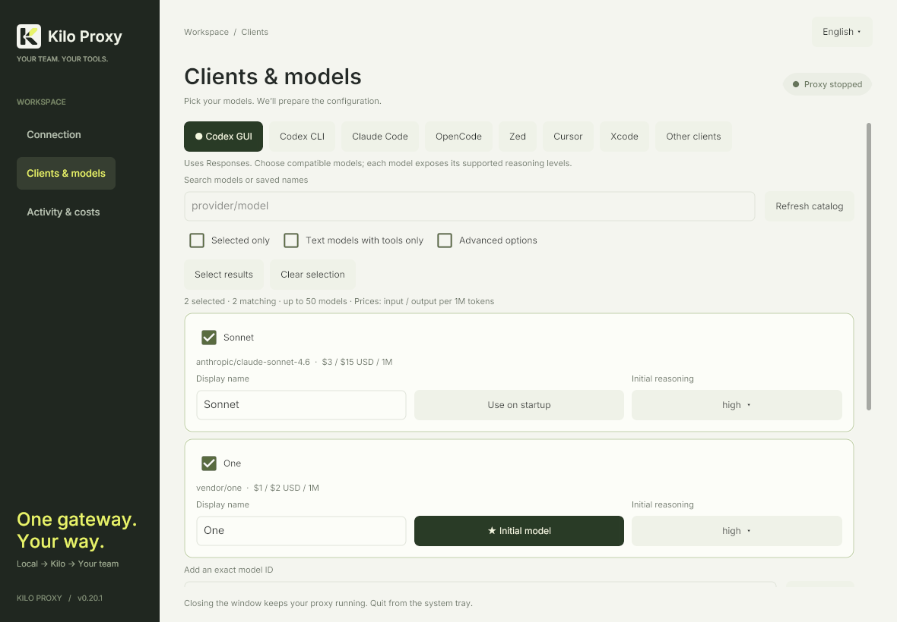
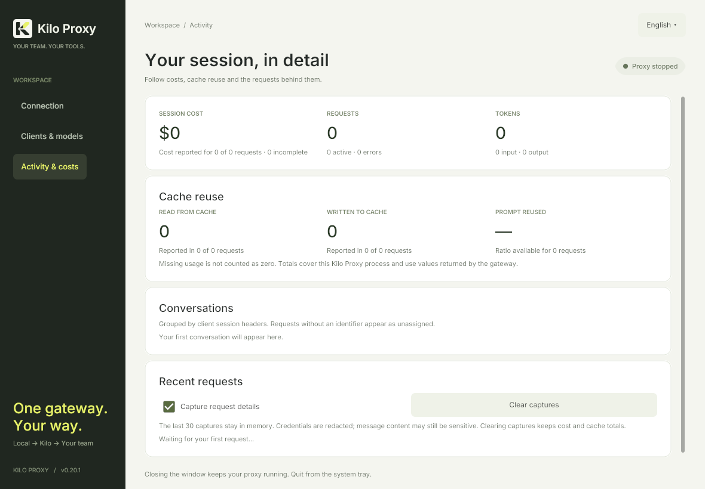

# Native desktop application

The native desktop migration is being developed in a separate branch for pull-request review. It does not create a new release or change the current published version. Existing downloadable releases may still use the browser interface.

The application is now named **Kilo Proxy** (formerly Kilo Local). Existing application configuration, system-store credentials and editor profile locations are preserved. Do not rename the `kilo-local` provider ID, `KILO_LOCAL_API_KEY`, or existing `.codex-kilo-*`, `.claude-kilo` and `.opencode-kilo` folders.

Kilo Proxy's desktop interface is written in Go with **Gio v0.10.2**. Forms, model selectors, configuration previews and activity views render directly through the operating system's graphics APIs. The system tray uses `fyne.io/systray`. There is no embedded browser, HTML renderer or WebView runtime in the native interface.

| Desktop target | Processor | Graphics |
| --- | --- | --- |
| macOS (`darwin`) | Apple Silicon (`arm64`) | Built-in Metal |
| macOS (`darwin`) | Intel (`amd64`) | Built-in Metal |
| Windows | ARM64 (`arm64`) | Built-in Direct3D 11 |
| Windows | x64 (`amd64`) | Built-in Direct3D 11 |
| Linux | ARM64 (`arm64`) | System graphics libraries and X11/Wayland |
| Linux | x64 (`amd64`) | System graphics libraries and X11/Wayland |

These are six desktop targets. This project does not provide Android, iOS or tablet packages. Windows ships as a standalone GUI executable that uses Windows' existing APIs; it does not need a WebView2 installer, Go, Node or an additional UI runtime.

The interface embeds the unmodified Regular, Medium and SemiBold fonts from [Inter 4.1](https://github.com/rsms/inter/releases/tag/v4.1), with Go fonts as a fallback. Nothing is installed into the user’s system font collection. The full font license is included in `THIRD-PARTY-NOTICES.txt`.

The native frontend uses the existing authenticated loopback API, keeping configuration validation, safe file updates, credentials and proxy accounting in one backend. External HTTPS links, including Kilo's sign-in page, open in the system browser. Copy controls use the OS clipboard. Client **Launch** controls use the authenticated backend to prepare profiles and open installed agents on this computer, with a shared project-folder field. See [client launch behavior](clients.md#launch-installed-clients). The existing browser interface remains available through an explicit launch option.

## Interface preview

These images are rendered by Gio with synthetic test data, using the same layout and GPU renderer as the native window. They are not browser mockups. CI also captures compact window sizes for each desktop target.







## Window and tray

- Launch Kilo Proxy to open its native window and create the tray/menu-bar icon.
- Closing the window leaves the application and an active proxy running, including requests already in progress.
- Choose **Open Kilo Proxy…** in the tray menu to reopen the interface with the same application session.
- The tray shows the team, endpoint, request counts and connection state. **Start proxy** and **Stop proxy** control the same backend as the window.
- **Stop proxy** cancels active requests. **Quit Kilo Proxy** stops the application and proxy.

The tray needs a desktop environment that supports status icons. Linux shells differ in where or whether they display StatusNotifierItem/AppIndicator icons. Browser and headless modes remain available when native desktop integration is unsuitable.

## Language

On startup, a saved English or Spanish application preference takes priority. Without a saved choice, Kilo Proxy reads the operating system's preferred language:

- **macOS:** `AppleLanguages`, then `AppleLocale`, with a bounded timeout.
- **Windows:** the native `GetUserPreferredUILanguages` API.
- **Linux:** `LC_ALL`, `LANGUAGE`, `LC_MESSAGES`, then `LANG`.

The first supported preference is used; otherwise the language is English. Region and encoding variants such as `es-MX` and `es_ES.UTF-8` are recognized. Change the language selector to save an explicit preference. Window content changes immediately, and the tray refreshes on its next update without restarting the proxy. Known backend notices and sign-in errors use the same language; external error details are preserved.

## Runtime requirements

**macOS:** packaging declares macOS 12.0 as the deployment target and uses system graphics and Cocoa. Testing on a current CI runner does not establish compatibility with every older macOS release.

**Windows:** choose the x64 or ARM64 executable for your machine. The native interface uses the operating system's Direct3D implementation. No separate browser-engine installation is needed.

**Linux:** a graphical session, session D-Bus, a compatible graphics driver and the usual X11/Wayland graphics libraries are required. On Ubuntu 24.04, CI installs:

```sh
sudo apt-get install libwayland-client0 libwayland-cursor0 libwayland-egl1 \
  libx11-6 libx11-xcb1 libxkbcommon-x11-0 libxcursor1 libxfixes3 \
  libegl1 libgles2 mesa-vulkan-drivers
```

Linux executables use system libraries; they are not universal binaries with all graphics dependencies bundled. Package names and availability vary between distributions.

## Optional launch modes

Use these options with the executable. In Windows archives it is named `Kilo Proxy.exe`; in the macOS bundle it is `Kilo Proxy.app/Contents/MacOS/kilo-proxy`.

| Option | Behavior |
| --- | --- |
| No options | Show the native window and system tray. |
| `--no-browser` | Start in the tray with the window closed after desktop initialization. With `--browser`, suppress automatic browser launch. |
| `--browser` | Use the system browser and authenticated loopback panel; no native window or tray is created. |
| `--no-tray` | Run headlessly without a native window or tray. Print the loopback panel URL without opening it automatically. |
| `--config-dir PATH` | Use a separate application configuration directory. |
| `--version` | Print the version and exit. |

An explicitly supplied `--browser` can be combined with `--no-tray` to open the browser while keeping native desktop integration disabled. Use `--browser --no-browser` to print its URL without opening a tab. Browser/headless processes can be stopped from the control panel or with the terminal's interrupt signal.

## Building locally

The proxy, admin API and shared helpers compile without GUI dependencies:

```sh
go build -o kilo-proxy .
./kilo-proxy --browser
# Or: ./kilo-proxy --no-tray
```

This build deliberately omits the native window. Build the desktop application with the `desktop` tag:

```sh
go build -tags desktop -o kilo-proxy .
```

macOS and Linux desktop builds require CGO and the platform's development tools. Windows desktop builds use `CGO_ENABLED=0`. On Ubuntu 24.04, the development packages used by CI are:

```sh
sudo apt-get install build-essential pkg-config libwayland-dev libx11-dev \
  libx11-xcb-dev libxkbcommon-x11-dev libxcursor-dev libxfixes-dev \
  libegl1-mesa-dev libgles2-mesa-dev libvulkan-dev
```

Use `scripts/package.py` for the production tags, linker settings and platform resources. Linux desktop builds require a native host for each architecture, and macOS builds require a macOS host. Gio's narrowly scoped platform patches are documented with the vendored source in `third_party/gio`.

## Validation and packaging gates

Validation separates the native interface from the optional browser frontend:

1. **Core:** Go race tests, `go vet`, module verification, JavaScript helper tests and Python packaging/release tests on macOS, Linux and Windows.
2. **Native controls:** tests built with `-tags desktop` exercise Gio controls and backend effects using temporary profiles and a synthetic gateway. Real pointer and keyboard tests verify navigation, wrapped tabs, focus, typing and model selection at wide, compact and minimum-width window sizes. Model-grid checks cover separate column hit targets, expanded-card settings, scrolling and resize anchoring; a large catalog verifies that off-screen rows remain virtualized. Shared Go helper tests compare catalogs, reasoning, launch commands and guides with the existing browser implementations; executable shell tests verify quoting and environment isolation. Launch tests use fake agents and temporary profiles to verify preparation, dispatch, project directories, duplicate clicks, edits during preparation and failure recovery. Platform tests verify private terminal tickets, inherited interactive input/output, environment isolation and Windows console handles.
3. **Optional browser:** Playwright runs Chromium and WebKit against an isolated local backend. These tests verify browser-mode behavior, not the native renderer.
4. **Real desktop:** `scripts/smoke_desktop.py` launches the production executable. It checks rendered native content, authenticated backend access, window/tray language changes, OS clipboard, proxy startup, close/reopen behavior, tray stop and clean process exit.
5. **Packaging:** the workflow requires its core, browser and native jobs to pass before creating bundles. It packages the tested executable, then exercises the extracted archive. macOS also receives full bundle-signature and LaunchServices checks. The aggregate job validates six archives and their checksums.

A future tag-triggered release remains gated on the reusable build workflow. The native migration itself is delivered as a branch and pull request, without publishing or changing `VERSION`. Check the workflow run for the commit being reviewed to see which checks have actually passed.

To run a native smoke test locally:

```sh
python3 scripts/smoke_desktop.py --binary ./kilo-proxy
```

The executable's `--desktop-self-test REPORT.json` mode creates a fresh temporary profile and synthetic local gateway. Its report contains check names and errors. It does not use a saved Kilo account or send paid inference. Native lifecycle tests do not establish compatibility with every remote model, provider, client application or production Kilo service. Linux CI runs graphical tests inside Xvfb with a private D-Bus session and software graphics enabled.
